# Space Rings Thing Game Client (for Red Hat Gaming)
This repository is the Godot-based multiplayer client for the "Space Ring
Things" game. You will need to already have the [server
repository](https://github.com/redhat-gamedev/srt-godot-server) and the server's
prerequisites handled. The client also uses Protobufs for messaging, like the
server, and makes use of Git submodules in order to pull in the [Protobuf
descriptions](https://github.com/redhat-gamedev/srt-protobufs).

## How Can I Play This Game
Everything in currently in development. To play you'll need to roll up your
sleves and do a little bit of build/operations work. See the development notes
below for instructions on how to do that.

## Development Notes and Prerequisites
The game is currently being built with Linux and using Godot 3.5.1 with Mono.

This repo now uses submodules to point to the `Networking/protobufs`. Make sure to
`--recurse-submodules` when you clone. If you've already cloned prior to this
change, then run the following `git submodule update --init`.

Make sure that you are using the same commit/tag for both the client and server
in the `Networking/protobufs` folder.

### Running Your Own Everything / Testing Locally
You will need to run the game server, the AMQ messaging server, and this game
(client-side).

#### Server
Find/follow instructions for the [game server
here](https://github.com/redhat-gamedev/srt-godot-server). Once you have the
server working first, then you can run the game client with the Godot editor.

#### Client
This repo is the player game client.

If you are debugging the Godot server and Godot client on the same machine you
will want to do one of the following:

* Option 1. Goto `Editor->Editor Settings...` and search for the `Remote Port`
  setting (it's under `Network->Debug'). Change the port so that the client and
  server use different ports.
* Option 2. In the Server project, goto `Project->Export...` and export to your
  platform, then run the exported server.

#### Configuration
Go in the Resources folder, copy and rename the file client.cfg.template in client.cfg. Here you can set parameters like authentication and server url.

## Run authentication in development

### Run keycloak locally using docker

* fast way:

``` bash
docker run -p 8080:8080 -e KEYCLOAK_ADMIN=admin -e KEYCLOAK_ADMIN_PASSWORD=admin quay.io/keycloak/keycloak:20.0.3 start-dev
```

This command will start Keycloak exposed on the local port 8080. It will also create an initial admin user with username admin and password admin.

If you want to persist and reuse an existing keycloak configuration , you have to run the following command:

``` bash
 docker run -p 8080:8080 -v <you local path>:/opt/keycloak/data/h2 -e KEYCLOAK_ADMIN=admin -e KEYCLOAK_ADMIN_PASSWORD=admin quay.io/keycloak/keycloak:20.0.3 start-dev --import-realm
 ```

 where `<you local path>` represents the location on your filesystem. Be sure that docker have the right privileges to write there.

You can find more images here: https://quay.io/repository/keycloak/keycloak

for more customization you can follow the official guide:
https://www.keycloak.org/server/containers

### Setup keycloak

#### Create a new real

Go to http://localhost:8080 on your browser, then login using the credential admin/admin.

To create a new realm:

* click on the dropdown menu on the top-left side and then click the button **create realm**.

* fill out a form adding the name of the new Realm and click on the button **create**. For example *srt-game*.

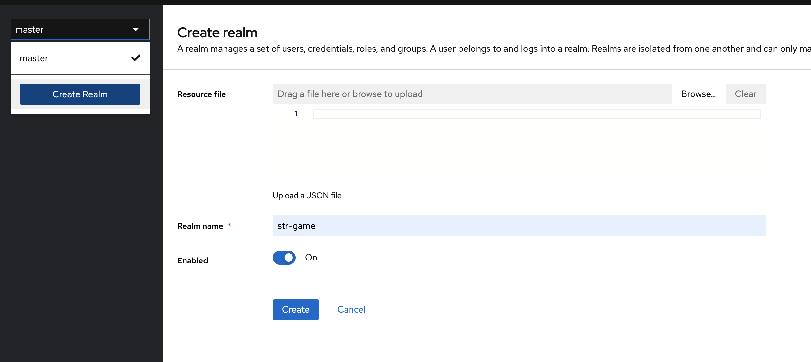

#### Configure the realm

If you want to test the authentication process many times, then you probably want to set the lifespan of the token to 1 minute.
In that case change *Realm setting* -> *Tokens* -> *Access Token Lifespan*

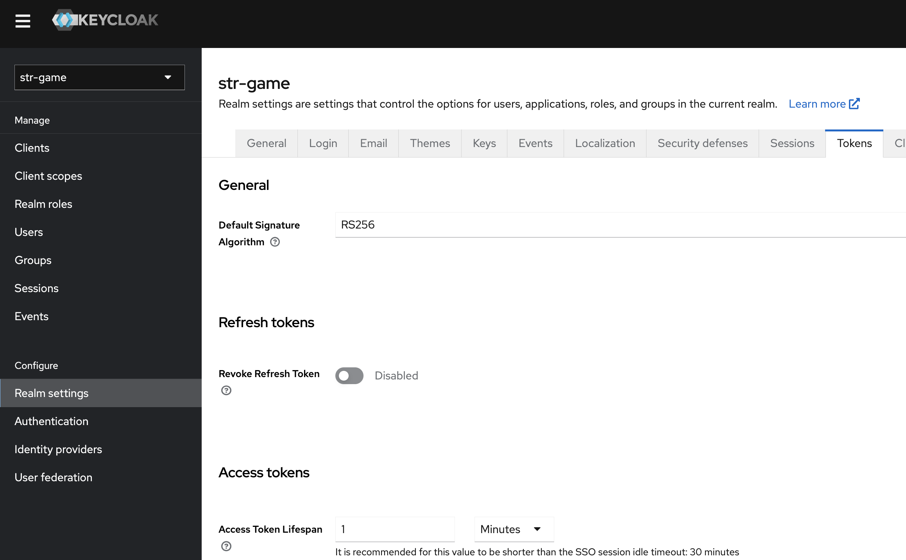

#### Create a new Client

* Go to *Clients* and press the button *Create client*

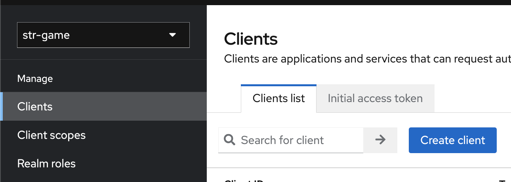

* Set the name of the new client, for example Str-game-client-001 then and press the button *next*

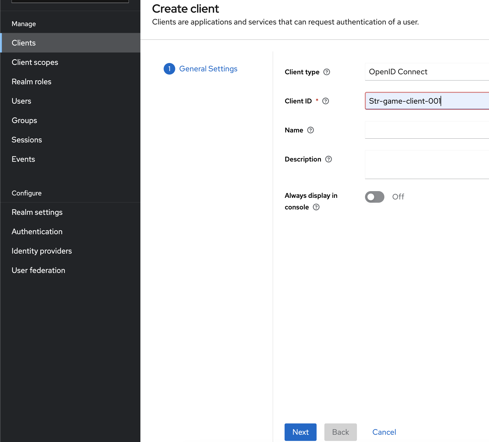

* Enable the following flags and press *save*

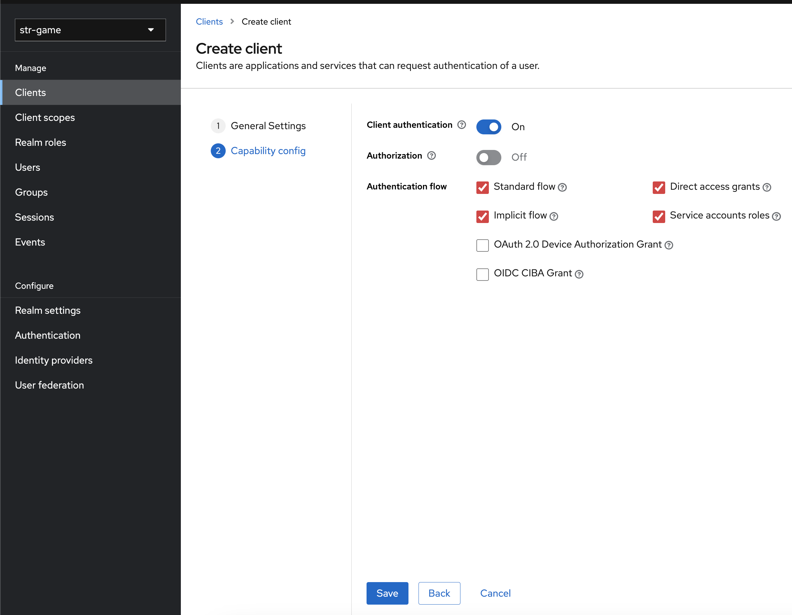

#### Configure the new Client

* Now you need to set the *valid redirect uri* then press *Save*.

The *valid redirect uri* is the location where keycloak sends the access token once the app has been successfully authorized. For that reason we run a server from this client and by default it listen to *127.0.0.1:31419*. In that case, the "valid redirect uri" to set in keycloak is http://127.0.0.1:31419

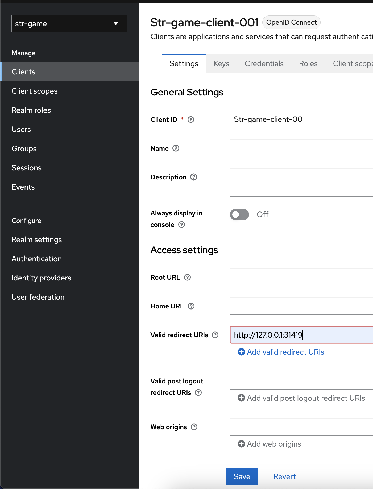

#### Create github auth app

* Go in your github account and click *settings*

* Go in *Developer settings -> Oauth app* then press on the button *new Oauth app*

* Here you need to set the *Authorization callback URL* with the *Redirect URI* from keycloak (see section below)

* "Homepage URL" is mandatory but you can use any words

#### Setup Github inside keycloak

* Go to the *Identity providers* section and click on the Github button.
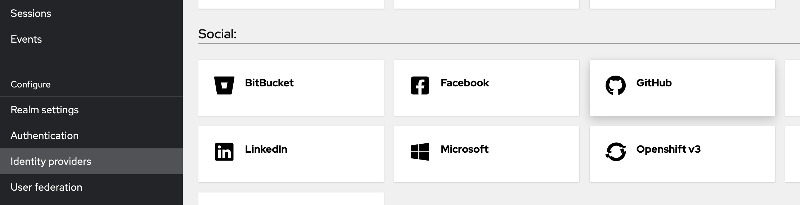

* Fill *Client ID* and *Client Secret* copying the values from your Github Auth app. In case you lost the *client secret* you can generate a new one from your Github Auth app. Then press *Add*

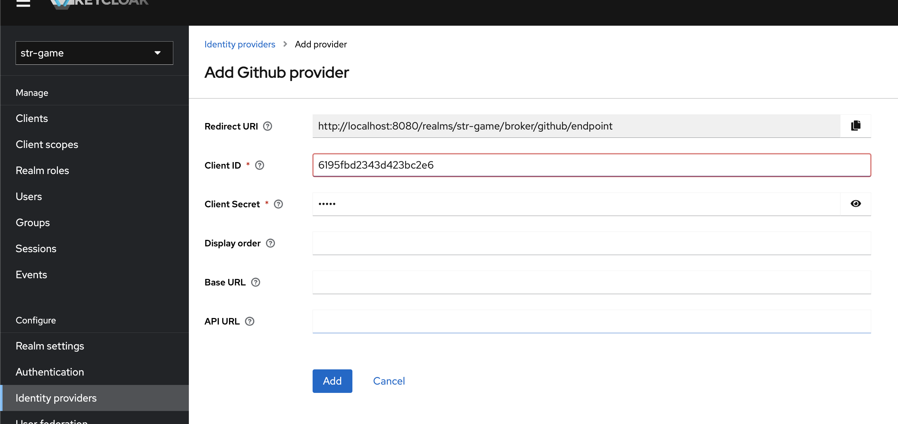

**Important**: As mentionated in the previous section, uou must copy the *Redirect URI* to your Github *Oauth app*.

### Setup str-godot-client

By default, in debug mode, the authentication is disabled, to activate it you need to configure some params:

* Go in *Resources/client.cfg* and set these variables:

``` csharp
activate_auth_dev=true // Enable/disable auth in dev mode

port="<set the TCP server port. Only change this if you need to change it>"; // This prop is also used to compose the valid redirect uri
address="<set TCP server address. Only change this if you need to change it>"; // This prop is also used to compose the valid redirect uri

client_id="<set the clientId with the keycloak Client ID>"; // Clients -> your client -> Client ID
client_secret="<set the client secret with the keycloak Client secret>"; // Clients -> credentials -> Client secret

auth_api_url= "<set the /auth url from keycloak>"; // Realm settings/OpenID Endpoint Configuration
token_api_url= "<set the /token url from keycloak>"; // Realm settings/OpenID Endpoint Configuration
```

#### Manual Test

* Run the game client and a new browser page should automatically open. Then press the button *Github*
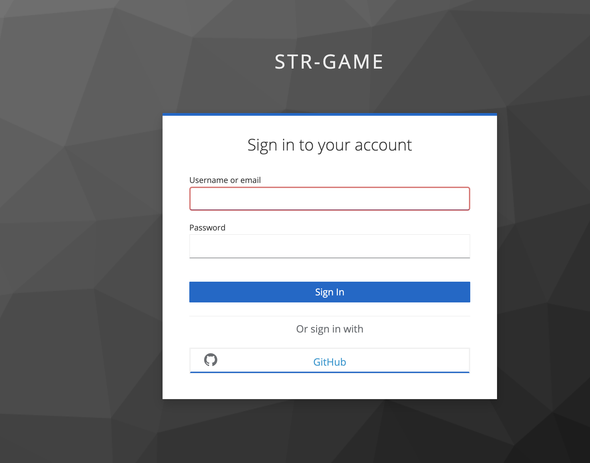

* Allow access to github
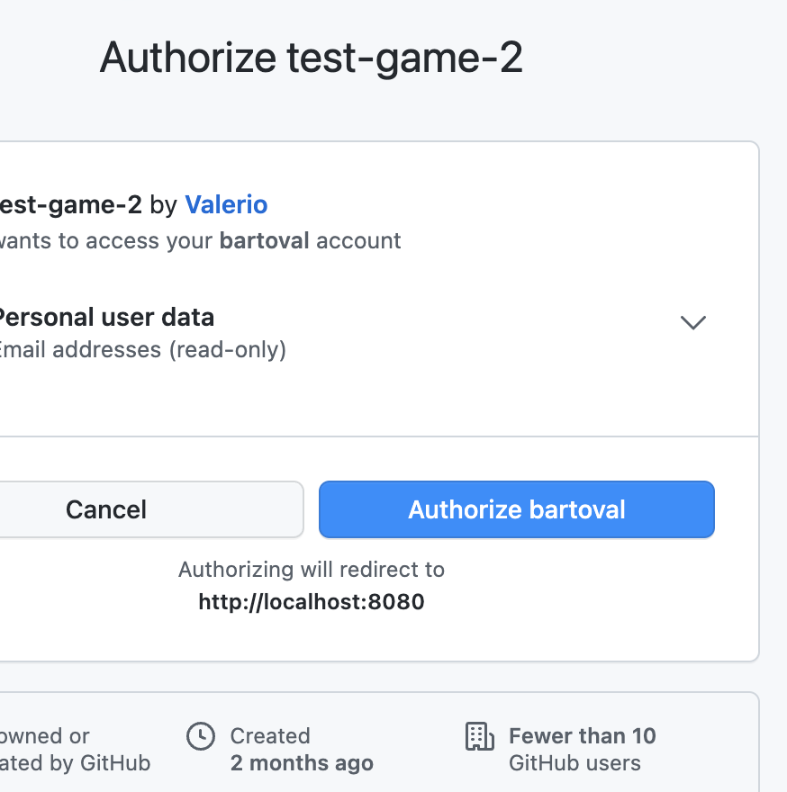

* Save your profile on Keycloak
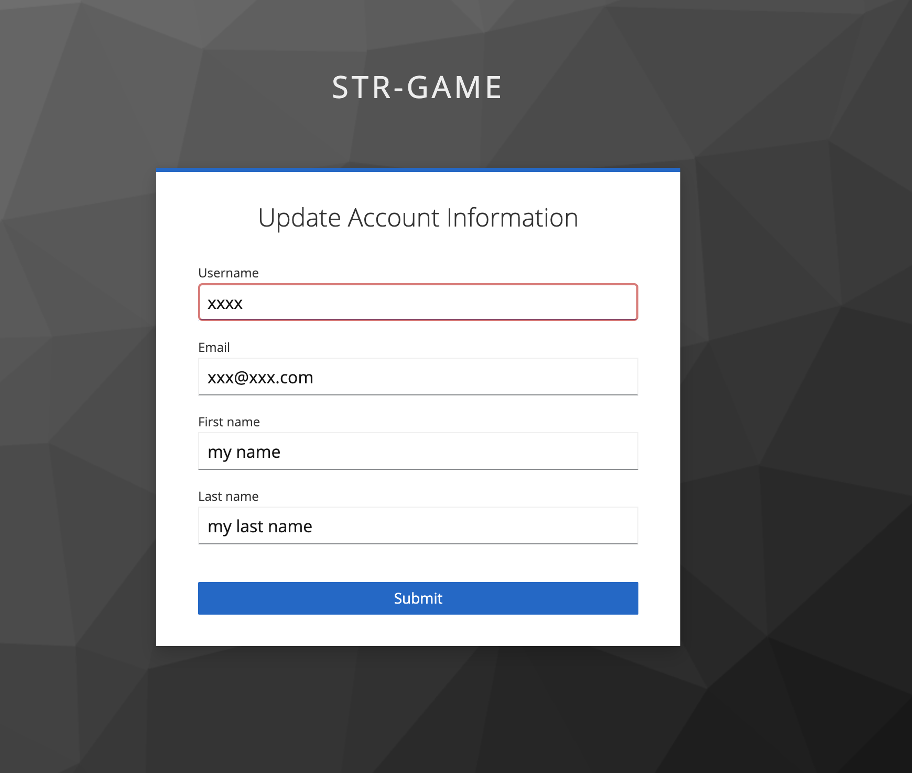

* Close the browser tab
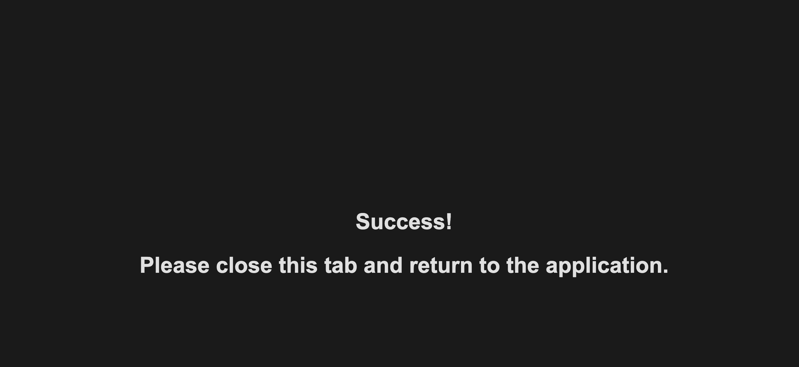

Now you can enjoy the game!

To make alternative tests you can let the refresh token expire. Otherwise the refresh token will always give you a new access_token and you can enter the game directly

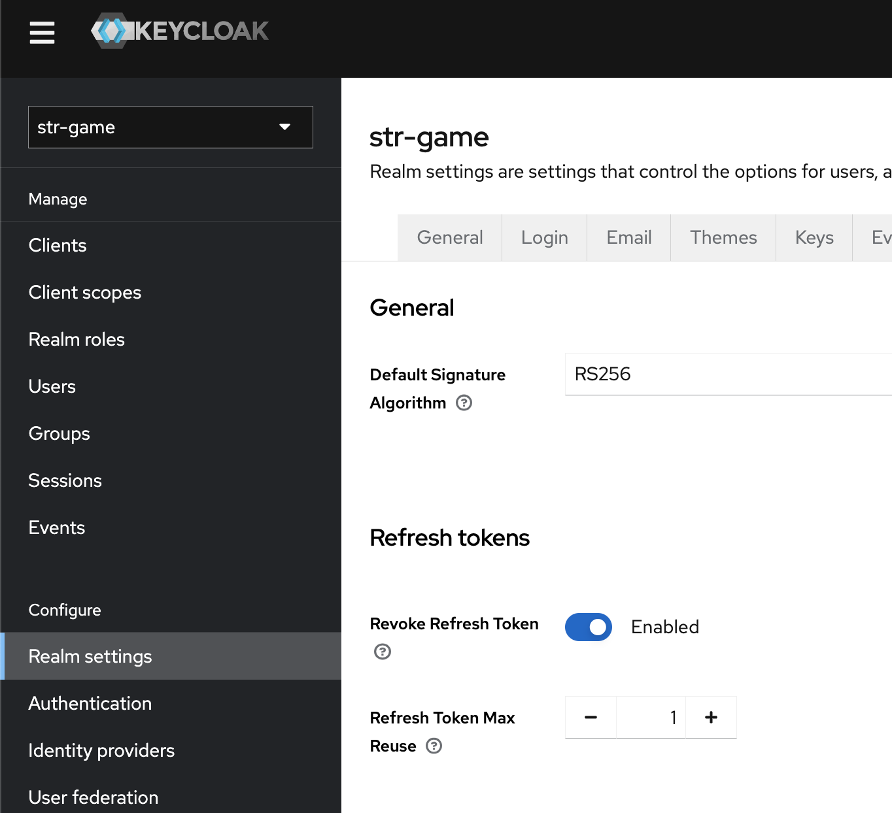
